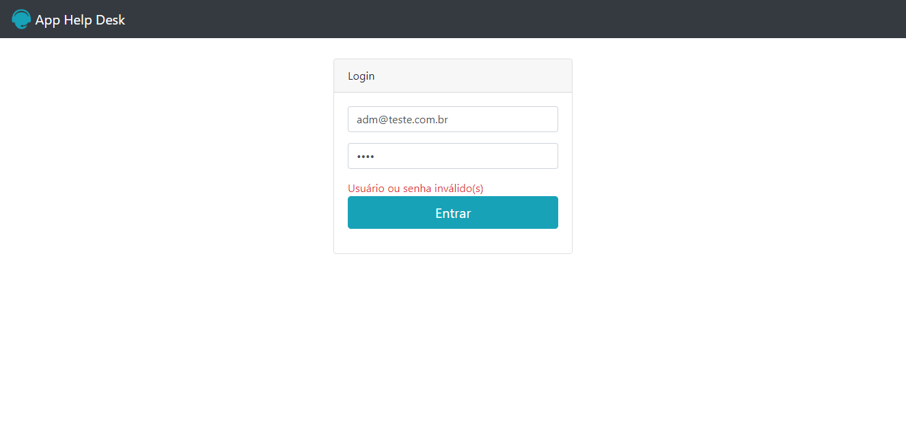
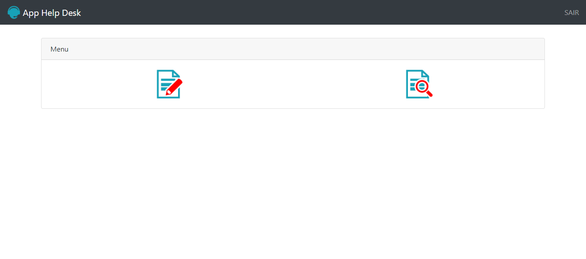
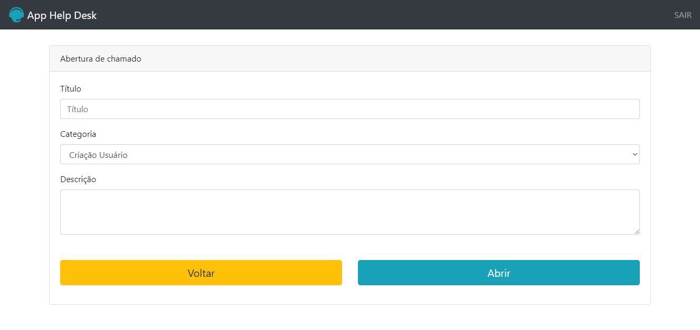
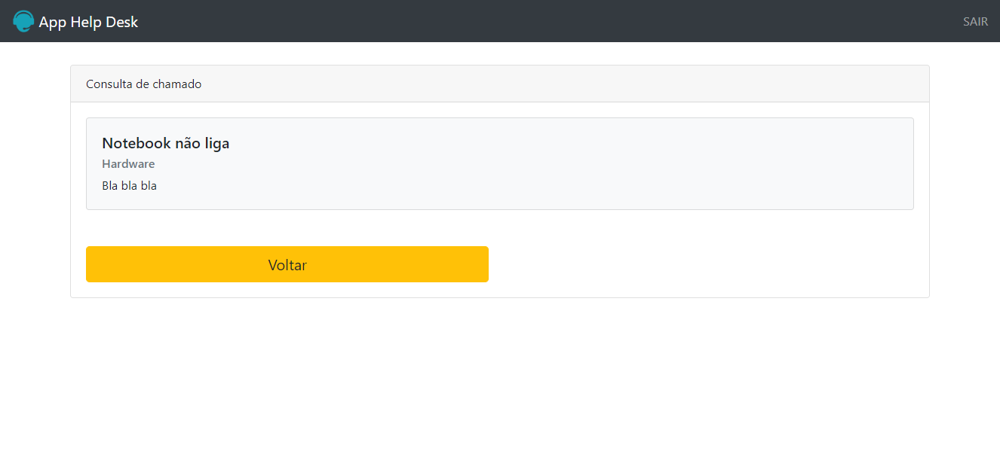

## Este projeto foi desenvolvido como material de Apoio do curso  Desenvolvimento Web completo 2020 da Udemy ministardo pelo professor Jorge Sant Ana
 
Onde é permitido fazer a realização de Logins usando $_SESSION do php para verificar se o usuario existe dentro de um array e assim direcionalo as suas respectivas views
de acordo com suas permições de acessos, um projeto bem simples sem a realização de banco de dados, onde é possivel entender de forma simples e resumida umas das posssiveis formas de se fazer um login e crud sem a ulização de banco de dados

